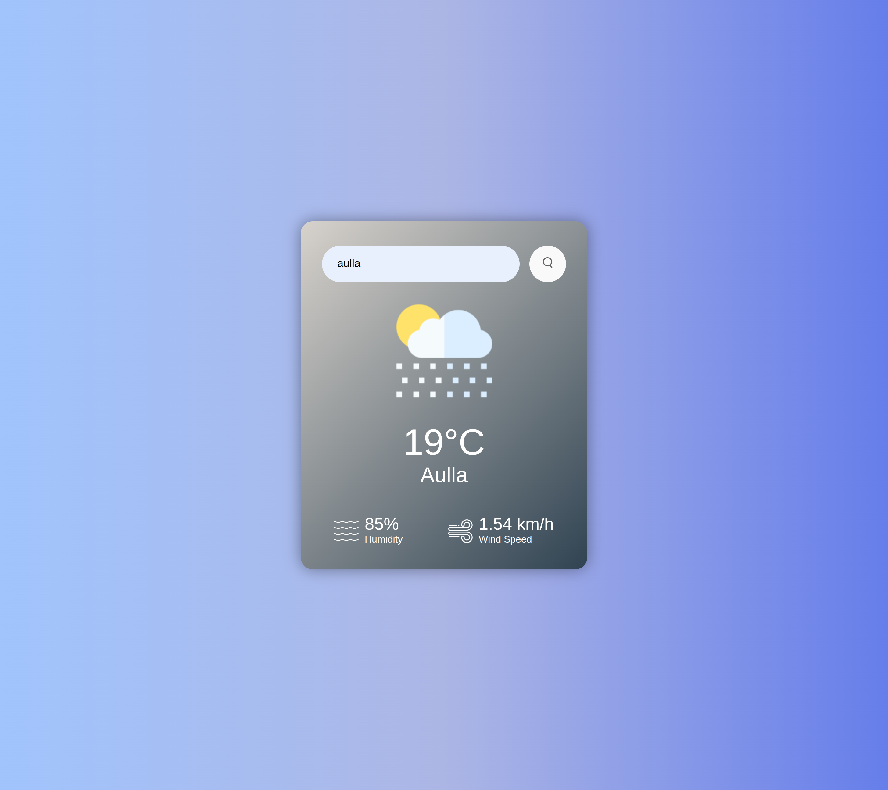
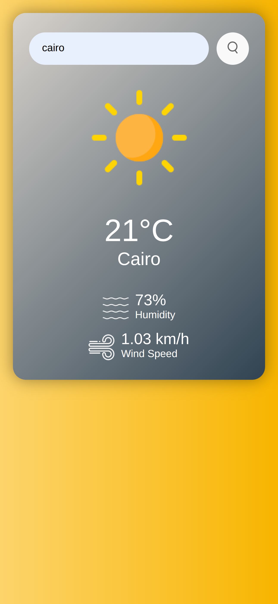

# 🌤️ Weather App

A clean, responsive weather app built with HTML, CSS, and JavaScript. Users can search for any city and get real-time weather information like temperature, humidity, wind speed, and more — all in a beautiful UI.

## 🚀 Features

- 🌎 Search for any city around the world
- 🌡️ Display real-time weather data (temperature, humidity, wind)
- 🎨 Modern, responsive UI with animations
- 📱 Mobile-friendly layout
- ⚠️ Displays user-friendly error messages

## 📸 Demo

📱 Responsive Design
This app is fully responsive and works smoothly across desktop and mobile screens.

✨ Screenshot

<p align="center">
  
  
  
</p>

## 🛠️ Technologies Used

- HTML5
- CSS3 (with media queries for responsiveness)
- JavaScript (Vanilla)
- [OpenWeatherMap API](https://openweathermap.org/api)

## 📦 Setup Instructions

1. **Clone the repository**
   ```bash
   git clone https://github.com/your-username/weather-app.git
   cd weather-app
   Get an API key
   Sign up at OpenWeatherMap
   Copy your API key
   Add your API key
   In script.js, replace the placeholder with your actual API key:
   const apiKey = "YOUR_API_KEY_HERE";
   Open index.html in your browser
   Or use a Live Server extension in VS Code for live preview.
   ```
